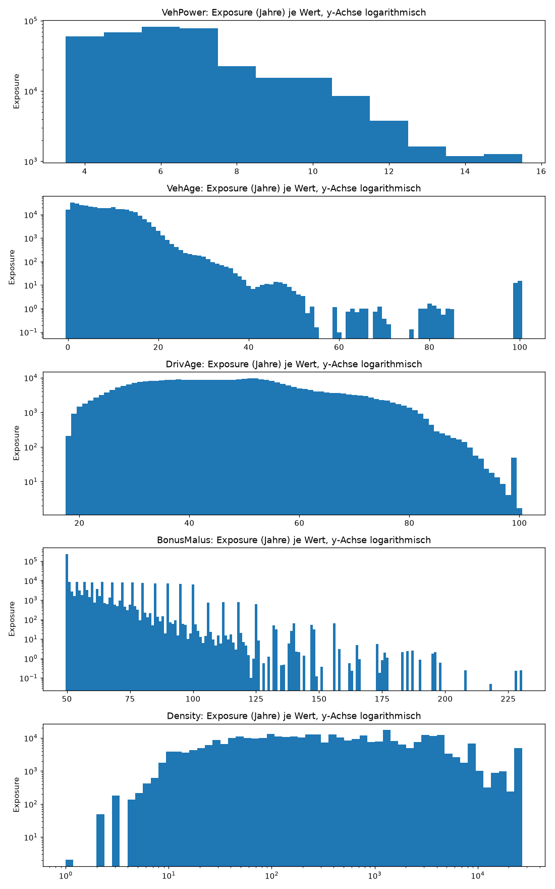
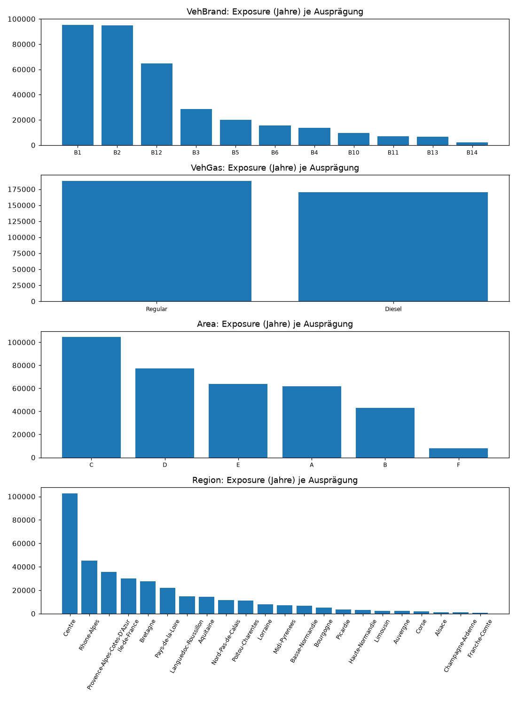
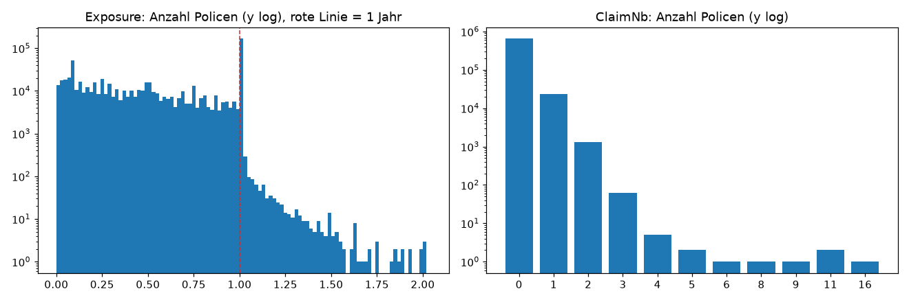
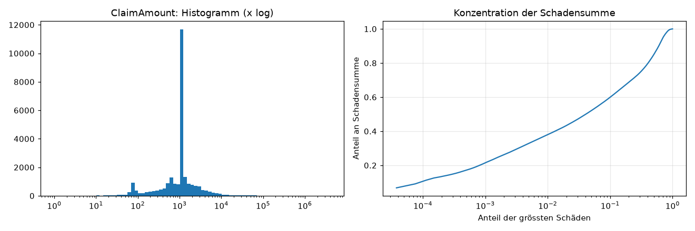
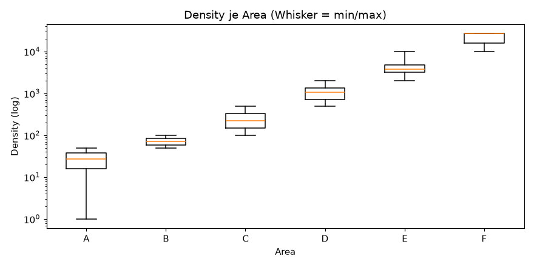
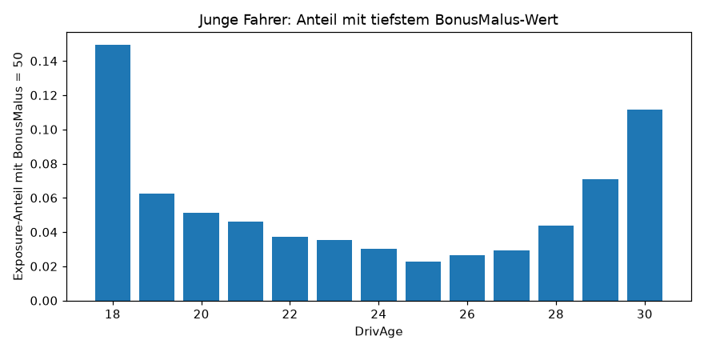

# Teil 1 – Datenübersicht (automatisch erzeugt)

Erzeugt von `src/teil1_datenuebersicht.py` aus `data/raw/`. Nicht von Hand bearbeiten.

- freq: 677,991 Zeilen × 12 Spalten, Exposure gesamt 358,482.8 Jahre

- sev: 26,444 Zeilen × 2 Spalten, Schadensumme 59,909,216

## T1.1 Variablenübersicht

| Datei | Variable | Typ | fehlend | eindeutige Werte | min | Median | max |
|---|---|---|---|---|---|---|---|
| freq | IDpol | float64 | 0 | 677,991 | 1 | 2,272,157 | 6,114,330 |
| freq | ClaimNb | int64 | 0 | 11 | 0 | 0 | 16 |
| freq | Exposure | float64 | 0 | 181 | 0.002732 | 0.49 | 2.01 |
| freq | VehPower | int64 | 0 | 12 | 4 | 6 | 15 |
| freq | VehAge | int64 | 0 | 78 | 0 | 6 | 100 |
| freq | DrivAge | int64 | 0 | 83 | 18 | 44 | 100 |
| freq | BonusMalus | int64 | 0 | 115 | 50 | 50 | 230 |
| freq | VehBrand | str | 0 | 11 |  |  |  |
| freq | VehGas | str | 0 | 2 |  |  |  |
| freq | Area | str | 0 | 6 |  |  |  |
| freq | Density | int64 | 0 | 1,607 | 1 | 393 | 27,000 |
| freq | Region | str | 0 | 22 |  |  |  |
| sev | IDpol | int64 | 0 | 24,944 | 139 | 2,133,756 | 6,113,971 |
| sev | ClaimAmount | float64 | 0 | 12,255 | 1 | 1,172 | 4,075,401 |

## T1.2 Konsistenz freq ↔ sev

| Prüfung | Anzahl |
|---|---|
| IDpol doppelt in freq | 0 |
| IDpol nicht ganzzahlig (freq) | 0 |
| sev-Zeilen ohne Police in freq | 0 |
| Policen mit ClaimNb > 0 | 24,944 |
| Summe ClaimNb in freq | 26,444 |
| Zeilen in sev | 26,444 |
| Policen mit ClaimNb > 0, aber ohne Betrag in sev | 0 |
| Policen mit ClaimNb = 0, aber Betrag in sev | 0 |
| Policen mit ClaimNb ≠ Anzahl sev-Zeilen | 0 |
| ClaimAmount ≤ 0 | 0 |

## T1.3 Auffällige Wertebereiche

| Auffälligkeit | Zeilen | Exposure | Schäden |
|---|---|---|---|
| Exposure > 1 Jahr | 1,224 | 1,363.3 | 54 |
| Exposure < 0.05 Jahre (≈ 18 Tage) | 42,385 | 1,019.5 | 342 |
| Exposure < 0.05 und ClaimNb > 0 | 332 | 8.2 | 342 |
| ClaimNb ≥ 4 | 13 | 4.4 | 91 |
| VehAge ≥ 99 | 48 | 27.9 | 1 |
| VehAge zwischen 40 und 98 | 198 | 136.1 | 2 |
| DrivAge = 99 | 70 | 49.4 | 4 |
| DrivAge ≥ 90 | 568 | 454.2 | 24 |
| DrivAge < 21 und BonusMalus = 50 | 320 | 163.2 | 19 |
| BonusMalus > 150 | 209 | 95.1 | 54 |
| Density = 27000 (Maximalwert) | 10,514 | 4,885.8 | 462 |
| ClaimAmount < 10 | 48 | – | 48 |
| ClaimAmount < 100 | 1,892 | – | 1,892 |
| ClaimAmount > 100'000 | 41 | – | 41 |

## T1.4 Policen mit ClaimNb ≥ 4

| IDpol | ClaimNb | Exposure | VehPower | VehAge | DrivAge | BonusMalus | VehBrand | VehGas | Area | Density | Region |
|---|---|---|---|---|---|---|---|---|---|---|---|
| 54,009 | 4 | 0.56 | 4 | 4 | 46 | 50 | B4 | Diesel | A | 29 | Centre |
| 3,016,883 | 4 | 0.27 | 5 | 9 | 23 | 90 | B3 | Diesel | E | 6,924 | Ile-de-France |
| 4,031,494 | 4 | 0.1 | 4 | 1 | 31 | 85 | B12 | Regular | E | 2,983 | Nord-Pas-de-Calais |
| 6,006,882 | 4 | 0.49 | 6 | 6 | 53 | 50 | B12 | Regular | E | 4,762 | Provence-Alpes-Cotes-D'Azur |
| 6,059,824 | 4 | 0.57 | 5 | 2 | 48 | 64 | B12 | Regular | D | 682 | Provence-Alpes-Cotes-D'Azur |
| 2,277,762 | 5 | 0.08 | 4 | 12 | 52 | 50 | B1 | Regular | D | 824 | Languedoc-Roussillon |
| 93,954 | 5 | 1 | 7 | 9 | 67 | 50 | B2 | Diesel | E | 4,762 | Provence-Alpes-Cotes-D'Azur |
| 2,216,294 | 6 | 0.33 | 4 | 12 | 52 | 50 | B1 | Regular | D | 824 | Languedoc-Roussillon |
| 2,239,279 | 8 | 0.41 | 4 | 12 | 52 | 50 | B1 | Regular | D | 824 | Languedoc-Roussillon |
| 2,248,174 | 9 | 0.08 | 4 | 12 | 52 | 50 | B1 | Regular | D | 824 | Languedoc-Roussillon |
| 3,253,234 | 11 | 0.08 | 4 | 13 | 53 | 50 | B1 | Regular | D | 824 | Languedoc-Roussillon |
| 3,254,353 | 11 | 0.07 | 4 | 13 | 53 | 50 | B1 | Regular | D | 824 | Languedoc-Roussillon |
| 2,241,683 | 16 | 0.33 | 4 | 12 | 52 | 50 | B1 | Regular | D | 824 | Languedoc-Roussillon |

## T1.5 Policen mit identischem Merkmalsprofil

Profil = alle 9 Merkmale ausser IDpol, Exposure und ClaimNb.

| Policen mit genau diesem Profil | Anzahl Profile | Zeilen |
|---|---|---|
| 1 | 420,083 | 420,083 |
| 2 | 87,628 | 175,256 |
| 3 | 14,515 | 43,545 |
| 4 | 2,535 | 10,140 |
| 5 | 963 | 4,815 |
| > 5 | 3,021 | 24,152 |

## T1.6 Density je Area

| Area | min | median | max | count |
|---|---|---|---|---|
| A | 1 | 27 | 50 | 103,952 |
| B | 50 | 72 | 100 | 75,457 |
| C | 100 | 222 | 500 | 191,874 |
| D | 500 | 1,054 | 1,993 | 151,592 |
| E | 2,001 | 3,744 | 9,850 | 137,163 |
| F | 10,008 | 27,000 | 27,000 | 17,953 |

## T1.7 Konzentration der Schadensumme

| grösste Schäden (Anteil) | Anzahl | Anteil an Schadensumme |
|---|---|---|
| 0.01% | 3 | 11.3% |
| 0.10% | 26 | 21.4% |
| 1.00% | 264 | 38.0% |
| 10.00% | 2,644 | 59.9% |
| 50.00% | 13,222 | 84.9% |

## T1.8 Häufigste Schadenbeträge

| ClaimAmount | Anzahl | Anteil |
|---|---|---|
| 1,204 | 4,792 | 0.1812 |
| 1,128.1200 | 3,056 | 0.1156 |
| 1,172 | 2,071 | 0.0783 |
| 1,128 | 831 | 0.0314 |
| 602 | 433 | 0.0164 |
| 1,320 | 175 | 0.0066 |
| 556.1400 | 155 | 0.0059 |
| 586 | 103 | 0.0039 |
| 564.0600 | 94 | 0.0036 |
| 1,500 | 87 | 0.0033 |

## Plots

### P1.1 Numerische Merkmale

### P1.2 Kategoriale Merkmale

### P1.3 Exposure und ClaimNb

### P1.4 Schadenhöhen

### P1.5 Area vs. Density

### P1.6 Junge Fahrer und BonusMalus

