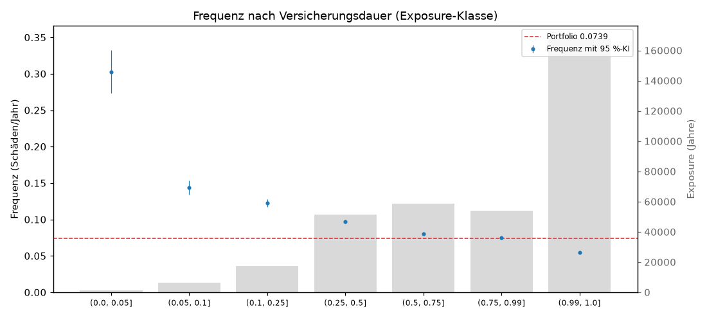
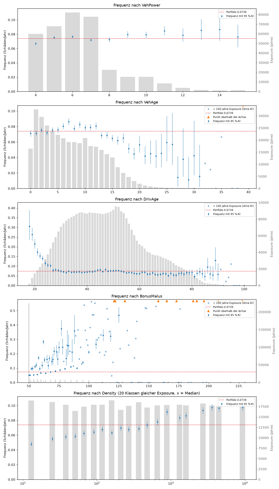
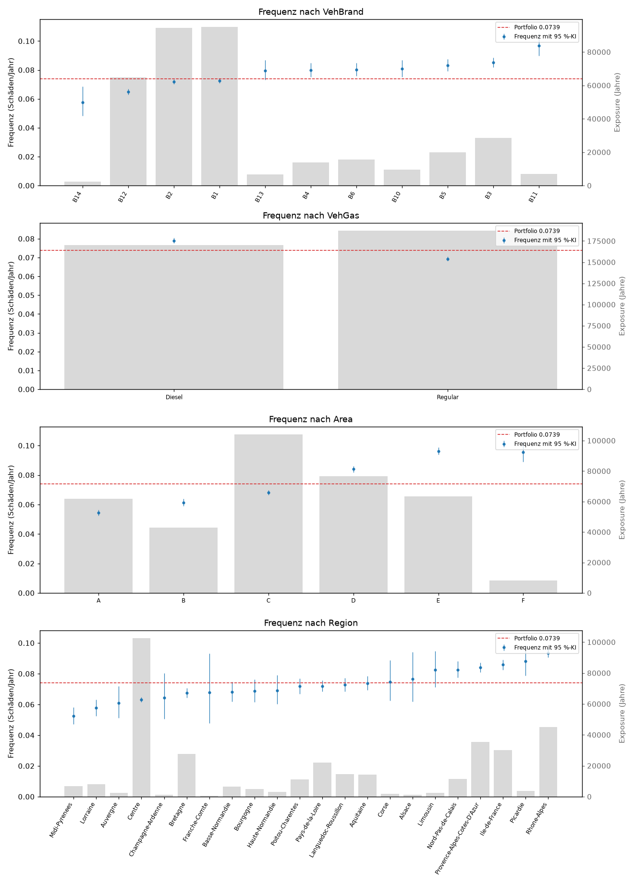
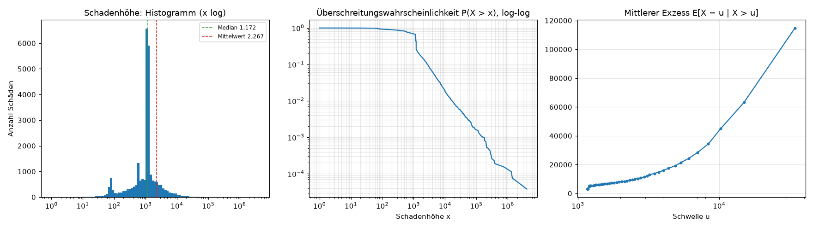
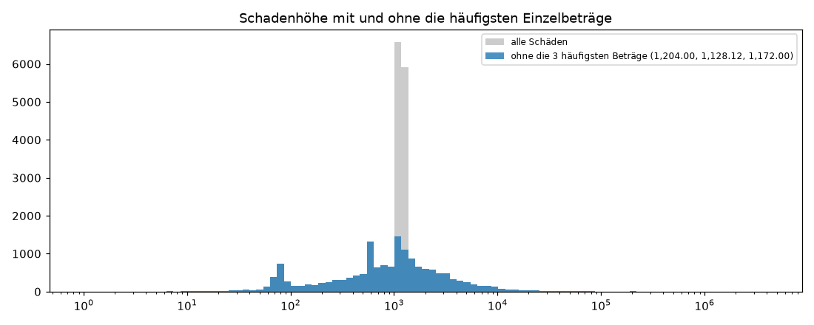

# Teil 2 – Schadenfrequenz und Schadenhöhe (automatisch erzeugt)

Erzeugt von `src/teil2_visualisierung.py` aus `data/processed/`. Nicht von Hand bearbeiten.

In den Frequenzplots: graue Balken = Exposure (rechte Achse), blaue Punkte = Frequenz Σ ClaimNb / Σ Exposure mit exaktem 95 %-Poisson-Intervall (linke Achse), rote Linie = Portfolio. Gruppen mit weniger als 100 Jahren Exposure sind als leere Punkte ohne KI gezeichnet und bestimmen die y-Achse nicht; Punkte oberhalb der y-Achse sind als orange Dreiecke markiert. Alle Werte stehen in `tabellen/`.

## T2.1 Definitionen der Schadenfrequenz im Vergleich

| Definition | Wert | Bemerkung |
|---|---|---|
| A: Σ ClaimNb / Σ Exposure | 0.0739 | Schäden pro Versicherungsjahr im Portfolio |
| B: Mittelwert von ClaimNb / Exposure je Police | 0.1188 | jede Police zählt gleich, egal wie lange versichert |
| C: Mittelwert von ClaimNb je Police | 0.0390 | ignoriert die Versicherungsdauer |
| D: Anteil Policen mit ≥ 1 Schaden | 0.0368 | ignoriert Dauer und Mehrfachschäden |

## T2.2 Frequenz nach Versicherungsdauer

| Exposure_Klasse | Policen | Exposure | Schaeden | Frequenz | KI_unten | KI_oben | Anteil_Exposure |
|---|---|---|---|---|---|---|---|
| (0.0, 0.05] | 49,327 | 1,366.9 | 413 | 0.3021 | 0.2737 | 0.3327 | 0.38% |
| (0.05, 0.1] | 78,240 | 6,161.7 | 884 | 0.1435 | 0.1342 | 0.1532 | 1.73% |
| (0.1, 0.25] | 95,181 | 17,427.8 | 2,139 | 0.1227 | 0.1176 | 0.1280 | 4.88% |
| (0.25, 0.5] | 131,256 | 51,370.8 | 4,985 | 0.0970 | 0.0944 | 0.0998 | 14.39% |
| (0.5, 0.75] | 92,440 | 58,540.5 | 4,713 | 0.0805 | 0.0782 | 0.0828 | 16.40% |
| (0.75, 0.99] | 62,023 | 54,054.4 | 4,037 | 0.0747 | 0.0724 | 0.0770 | 15.15% |
| (0.99, 1.0] | 167,984 | 167,984.0 | 9,212 | 0.0548 | 0.0537 | 0.0560 | 47.07% |

### P2.1 Frequenz nach Versicherungsdauer

## Frequenz je Merkmal

### P2.2 Numerische Merkmale

### P2.3 Kategoriale Merkmale

## T2.3 Frequenztabellen kategoriale Merkmale

### T2.3 VehBrand

| VehBrand | Exposure | Schaeden | Frequenz | KI_unten | KI_oben | Anteil_Exposure |
|---|---|---|---|---|---|---|
| B14 | 2,252.5 | 130 | 0.0577 | 0.0482 | 0.0685 | 0.63% |
| B12 | 64,729.3 | 4,199 | 0.0649 | 0.0629 | 0.0669 | 18.14% |
| B2 | 94,388.9 | 6,782 | 0.0719 | 0.0702 | 0.0736 | 26.45% |
| B1 | 94,884.5 | 6,884 | 0.0726 | 0.0708 | 0.0743 | 26.59% |
| B13 | 6,727.4 | 536 | 0.0797 | 0.0731 | 0.0867 | 1.88% |
| B4 | 13,732.9 | 1,098 | 0.0800 | 0.0753 | 0.0848 | 3.85% |
| B6 | 15,598.4 | 1,250 | 0.0801 | 0.0758 | 0.0847 | 4.37% |
| B10 | 9,421.8 | 763 | 0.0810 | 0.0753 | 0.0869 | 2.64% |
| B5 | 19,912.5 | 1,659 | 0.0833 | 0.0794 | 0.0874 | 5.58% |
| B3 | 28,431.6 | 2,420 | 0.0851 | 0.0818 | 0.0886 | 7.97% |
| B11 | 6,826.3 | 662 | 0.0970 | 0.0897 | 0.1047 | 1.91% |

### T2.3 VehGas

| VehGas | Exposure | Schaeden | Frequenz | KI_unten | KI_oben | Anteil_Exposure |
|---|---|---|---|---|---|---|
| Diesel | 169,918.8 | 13,426 | 0.0790 | 0.0777 | 0.0804 | 47.61% |
| Regular | 186,987.3 | 12,957 | 0.0693 | 0.0681 | 0.0705 | 52.39% |

### T2.3 Area

| Area | Exposure | Schaeden | Frequenz | KI_unten | KI_oben | Anteil_Exposure |
|---|---|---|---|---|---|---|
| A | 61,784.2 | 3,359 | 0.0544 | 0.0525 | 0.0562 | 17.31% |
| B | 42,870.5 | 2,633 | 0.0614 | 0.0591 | 0.0638 | 12.01% |
| C | 103,990.6 | 7,073 | 0.0680 | 0.0664 | 0.0696 | 29.14% |
| D | 76,756.1 | 6,447 | 0.0840 | 0.0820 | 0.0861 | 21.51% |
| E | 63,409.2 | 6,097 | 0.0962 | 0.0938 | 0.0986 | 17.77% |
| F | 8,095.6 | 774 | 0.0956 | 0.0890 | 0.1026 | 2.27% |

### T2.3 Region

| Region | Exposure | Schaeden | Frequenz | KI_unten | KI_oben | Anteil_Exposure |
|---|---|---|---|---|---|---|
| Midi-Pyrenees | 6,931.4 | 364 | 0.0525 | 0.0473 | 0.0582 | 1.94% |
| Lorraine | 8,108.0 | 468 | 0.0577 | 0.0526 | 0.0632 | 2.27% |
| Auvergne | 2,314.3 | 141 | 0.0609 | 0.0513 | 0.0719 | 0.65% |
| Centre | 102,522.5 | 6,473 | 0.0631 | 0.0616 | 0.0647 | 28.73% |
| Champagne-Ardenne | 1,197.4 | 77 | 0.0643 | 0.0507 | 0.0804 | 0.34% |
| Bretagne | 27,722.0 | 1,869 | 0.0674 | 0.0644 | 0.0705 | 7.77% |
| Franche-Comte | 560.8 | 38 | 0.0678 | 0.0480 | 0.0930 | 0.16% |
| Basse-Normandie | 6,632.6 | 451 | 0.0680 | 0.0619 | 0.0746 | 1.86% |
| Bourgogne | 4,999.7 | 343 | 0.0686 | 0.0615 | 0.0763 | 1.40% |
| Haute-Normandie | 3,164.9 | 219 | 0.0692 | 0.0603 | 0.0790 | 0.89% |
| Poitou-Charentes | 11,140.5 | 800 | 0.0718 | 0.0669 | 0.0770 | 3.12% |
| Pays-de-la-Loire | 21,882.9 | 1,574 | 0.0719 | 0.0684 | 0.0756 | 6.13% |
| Languedoc-Roussillon | 14,499.8 | 1,055 | 0.0728 | 0.0684 | 0.0773 | 4.06% |
| Aquitaine | 14,256.2 | 1,053 | 0.0739 | 0.0695 | 0.0785 | 3.99% |
| Corse | 1,765.9 | 132 | 0.0747 | 0.0625 | 0.0886 | 0.49% |
| Alsace | 1,200.6 | 92 | 0.0766 | 0.0618 | 0.0940 | 0.34% |
| Limousin | 2,391.8 | 197 | 0.0824 | 0.0713 | 0.0947 | 0.67% |
| Nord-Pas-de-Calais | 11,372.5 | 940 | 0.0827 | 0.0775 | 0.0881 | 3.19% |
| Provence-Alpes-Cotes-D'Azur | 35,444.5 | 2,977 | 0.0840 | 0.0810 | 0.0871 | 9.93% |
| Ile-de-France | 30,079.3 | 2,581 | 0.0858 | 0.0825 | 0.0892 | 8.43% |
| Picardie | 3,563.8 | 314 | 0.0881 | 0.0786 | 0.0984 | 1.00% |
| Rhone-Alpes | 45,154.8 | 4,225 | 0.0936 | 0.0908 | 0.0964 | 12.65% |

## T2.4 Frequenztabelle Density-Klassen

| Klasse | Exposure | Schaeden | Frequenz | KI_unten | KI_oben | Anteil_Exposure | min | max | median |
|---|---|---|---|---|---|---|---|---|---|
| 0 | 18,930.1 | 907 | 0.0479 | 0.0448 | 0.0511 | 5.30% | 1 | 18 | 13 |
| 1 | 18,598.6 | 1,022 | 0.0550 | 0.0516 | 0.0584 | 5.21% | 19 | 30 | 25 |
| 2 | 17,900.3 | 1,037 | 0.0579 | 0.0545 | 0.0616 | 5.02% | 31 | 44 | 38 |
| 3 | 16,445.9 | 962 | 0.0585 | 0.0549 | 0.0623 | 4.61% | 45 | 57 | 51 |
| 4 | 17,455.9 | 1,092 | 0.0626 | 0.0589 | 0.0664 | 4.89% | 58 | 79 | 67 |
| 5 | 17,919.0 | 1,151 | 0.0642 | 0.0606 | 0.0681 | 5.02% | 80 | 104 | 91 |
| 6 | 17,899.4 | 1,210 | 0.0676 | 0.0638 | 0.0715 | 5.02% | 105 | 136 | 118 |
| 7 | 18,972.8 | 1,200 | 0.0632 | 0.0597 | 0.0669 | 5.32% | 137 | 182 | 159 |
| 8 | 16,683.2 | 1,161 | 0.0696 | 0.0656 | 0.0737 | 4.67% | 183 | 232 | 211 |
| 9 | 17,681.2 | 1,196 | 0.0676 | 0.0639 | 0.0716 | 4.95% | 233 | 301 | 270 |
| 10 | 18,512.4 | 1,272 | 0.0687 | 0.0650 | 0.0726 | 5.19% | 302 | 405 | 369 |
| 11 | 17,259.4 | 1,271 | 0.0736 | 0.0696 | 0.0778 | 4.84% | 406 | 568 | 478 |
| 12 | 17,765.4 | 1,385 | 0.0780 | 0.0739 | 0.0822 | 4.98% | 569 | 747 | 657 |
| 13 | 17,865.9 | 1,634 | 0.0915 | 0.0871 | 0.0960 | 5.01% | 748 | 1,064 | 883 |
| 14 | 17,900.8 | 1,492 | 0.0833 | 0.0792 | 0.0877 | 5.02% | 1,066 | 1,370 | 1,313 |
| 15 | 17,774.5 | 1,534 | 0.0863 | 0.0820 | 0.0907 | 4.98% | 1,374 | 2,019 | 1,601 |
| 16 | 18,232.0 | 1,702 | 0.0934 | 0.0890 | 0.0979 | 5.11% | 2,020 | 3,301 | 2,715 |
| 17 | 17,762.3 | 1,728 | 0.0973 | 0.0928 | 0.1020 | 4.98% | 3,302 | 3,963 | 3,599 |
| 18 | 17,559.5 | 1,693 | 0.0964 | 0.0919 | 0.1011 | 4.92% | 3,973 | 6,570 | 4,456 |
| 19 | 17,787.8 | 1,734 | 0.0975 | 0.0929 | 0.1022 | 4.98% | 6,595 | 27,000 | 9,307 |

## Schadenhöhe

### T2.5 Kennzahlen der Schadenhöhe

| Kennzahl | Wert |
|---|---|
| Anzahl | 26,383.00 |
| Mittelwert | 2,267.08 |
| Standardabweichung | 29,404.80 |
| Variationskoeffizient | 12.97 |
| Quantil 1.0% | 39.59 |
| Quantil 10.0% | 197.35 |
| Quantil 25.0% | 687.35 |
| Quantil 50.0% | 1,172.00 |
| Quantil 75.0% | 1,210.40 |
| Quantil 90.0% | 2,764.48 |
| Quantil 99.0% | 16,559.84 |
| Quantil 99.9% | 152,238.38 |
| Maximum | 4,075,400.56 |
| Mittelwert ohne grösste 0.1 % | 1,777.70 |

### P2.4 Verteilung der Schadenhöhe

### P2.5 Einfluss der häufigsten Einzelbeträge

