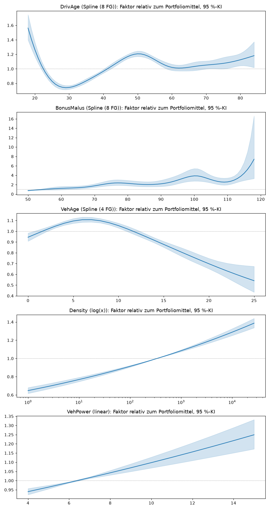
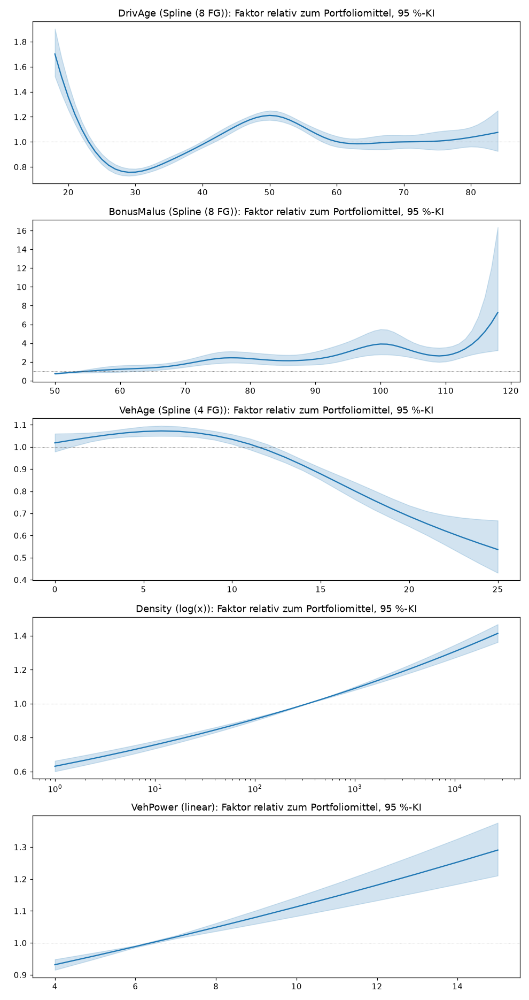

# Teil 3 – Frequenzmodelle (automatisch erzeugt)

Erzeugt von `src/teil3_frequenz.py`. Auswahl nur per Kreuzvalidierung auf dem Training (5 Folds nach Profil); Testdaten nur in F3.5–F3.6.

## F3.1 Kappung (99.5 %-Exposure-Quantil im Training)

| Merkmal | obere Grenze |
|---|---|
| DrivAge | 84 |
| BonusMalus | 118 |
| VehAge | 25 |

## F3.2 Auswahl VehPower (volles GLM, Region 22 einzeln)

1-SE-Regel: gewählt wird die Variante mit den wenigsten Parametern, deren Abstand zur besten höchstens ihrem Standardfehler entspricht.

| Variante | Parameter | CV-Deviance | Abstand zur besten | ± SE Abstand | gewählt |
|---|---|---|---|---|---|
| ohne VehPower | 54 | 0.242408 | 0.000127 | 0.000045 |  |
| VehPower linear | 55 | 0.242281 | 0.000000 | 0.000000 | ✔ |
| VehPower je Wert | 65 | 0.242291 | 0.000010 | 0.000030 |  |

## F3.3 Auswahl Regionsgruppierung (volles GLM)

| Variante | Parameter | CV-Deviance | Abstand zur besten | ± SE Abstand | gewählt |
|---|---|---|---|---|---|
| 22 einzeln | 55 | 0.242281 | 0.000000 | 0.000000 |  |
| Regionen < 1 % zusammen | 48 | 0.242314 | 0.000033 | 0.000009 |  |
| 8 Gruppen nach roher Frequenz | 41 | 0.242321 | 0.000040 | 0.000026 |  |
| 4 Gruppen nach Effekt zusätzlich zu Density | 37 | 0.242364 | 0.000083 | 0.000040 |  |
| 6 Gruppen nach Effekt zusätzlich zu Density | 39 | 0.242313 | 0.000032 | 0.000024 |  |
| 8 Gruppen nach Effekt zusätzlich zu Density | 41 | 0.242290 | 0.000009 | 0.000017 | ✔ |

Zuordnung der gewählten Gruppierung (Training):

| Gruppe | Region |
|---|---|
| Gruppe 1 | Auvergne, Basse-Normandie, Haute-Normandie, Ile-de-France, Lorraine, Midi-Pyrenees |
| Gruppe 2 | Bretagne, Champagne-Ardenne |
| Gruppe 3 | Pays-de-la-Loire |
| Gruppe 4 | Centre |
| Gruppe 5 | Alsace, Aquitaine |
| Gruppe 6 | Bourgogne, Languedoc-Roussillon, Provence-Alpes-Cotes-D'Azur |
| Gruppe 7 | Corse, Franche-Comte, Nord-Pas-de-Calais, Poitou-Charentes |
| Gruppe 8 | Limousin, Picardie, Rhone-Alpes |

## F3.3b Auswahl Zusatzkodierung BonusMalus (volles GLM)

Hintergrund: Häufige BonusMalus-Werte haben eine tiefere Frequenz als seltene Werte dazwischen (Teil 2, P2.2), was ein glatter Spline nicht abbilden kann.

| Variante | Parameter | CV-Deviance | Abstand zur besten | ± SE Abstand | gewählt |
|---|---|---|---|---|---|
| nur Spline | 41 | 0.242290 | 0.002447 | 0.000193 |  |
| + Indikator seltener Wert (< 1 % Exposure) | 42 | 0.241429 | 0.001586 | 0.000180 |  |
| + häufige Werte (≥ 0.5 %) je Wert, Rest selten | 60 | 0.239859 | 0.000016 | 0.000035 | ✔ |
| + häufige Werte (≥ 0.2 %) je Wert, Rest selten | 69 | 0.239843 | 0.000000 | 0.000000 |  |
| + jeder Wert eigene Kategorie | 109 | 0.239992 | 0.000150 | 0.000056 |  |

## F3.4 Gradient Boosting: Tuning

Lernrate 0.05, Poisson-Verlust, Iterationen per Kreuzvalidierung gewählt.

### Variante a

| max_leaf_nodes | min_samples_leaf | Iterationen | CV-Deviance |
|---|---|---|---|
| 7 | 500 | 749 | 0.239128 |
| 15 | 500 | 345 | 0.239093 |
| 31 | 500 | 96 | 0.238992 |

### Variante b (Exposure als Merkmal)

| max_leaf_nodes | min_samples_leaf | Iterationen | CV-Deviance |
|---|---|---|---|
| 7 | 500 | 943 | 0.234708 |
| 15 | 500 | 382 | 0.234817 |
| 31 | 500 | 157 | 0.234824 |

## F3.5 Vergleich auf den Testdaten

Deviance = mittlere Poisson-Deviance pro Police (kleiner ist besser). „nur volle Jahre“ = Testpolicen mit Exposure ≥ 0.99; das ist die Laufzeit, für die der Tarif gerechnet wird.

| Modell | Deviance Test | Deviance Test, nur volle Jahre | beobachtet/vorhergesagt | beob./vorh., nur volle Jahre | Verbesserung ggü. Nullmodell |
|---|---|---|---|---|---|
| Portfoliofrequenz (Nullmodell) | 0.246761 | 0.333447 | 0.979 | 0.750 | 0.000000 |
| GLM a (ohne Laufzeit) | 0.231464 | 0.297001 | 0.976 | 0.834 | 0.015297 |
| GLM b (mit Laufzeitklassen) | 0.229985 | 0.296199 | 0.979 | 1.026 | 0.016776 |
| GBM a (ohne Laufzeit) | 0.230897 | 0.297126 | 0.980 | 0.849 | 0.015864 |
| GBM b (mit Exposure) | 0.227433 | 0.291856 | 0.982 | 1.019 | 0.019328 |

## F3.6 Kalibrierung auf den Testdaten je Laufzeitklasse (beobachtet / vorhergesagt)

| Exposure-Klasse | GLM a (ohne Laufzeit) | GLM b (mit Laufzeitklassen) | GBM a (ohne Laufzeit) | GBM b (mit Exposure) |
|---|---|---|---|---|
| (0.0, 0.05] | 2.712 | 0.690 | 2.670 | 0.720 |
| (0.05, 0.1] | 1.314 | 0.759 | 1.314 | 0.784 |
| (0.1, 0.25] | 1.481 | 1.031 | 1.469 | 1.019 |
| (0.25, 0.5] | 1.102 | 0.963 | 1.100 | 0.977 |
| (0.5, 0.75] | 0.975 | 0.944 | 0.972 | 0.954 |
| (0.75, 0.99] | 0.961 | 0.992 | 0.952 | 0.997 |
| (0.99, 1.0] | 0.831 | 1.025 | 0.846 | 1.015 |

## F3.7 GLM b: Faktoren der kategorialen Merkmale (exp(β), 95 %-KI)

| Merkmal | Ausprägung | Faktor | KI unten | KI oben |
|---|---|---|---|---|
| VehBrand | B1 (Referenz) | 1.000 | nan | nan |
| VehBrand | B2 | 0.995 | 0.958 | 1.035 |
| VehBrand | B12 | 0.705 | 0.670 | 0.742 |
| VehBrand | B3 | 1.034 | 0.979 | 1.091 |
| VehBrand | B5 | 1.061 | 0.997 | 1.129 |
| VehBrand | B6 | 1.001 | 0.934 | 1.073 |
| VehBrand | B4 | 1.023 | 0.951 | 1.101 |
| VehBrand | B10 | 0.973 | 0.889 | 1.064 |
| VehBrand | B11 | 1.169 | 1.065 | 1.283 |
| VehBrand | B13 | 0.997 | 0.900 | 1.104 |
| VehBrand | B14 | 0.852 | 0.702 | 1.033 |
| VehGas | Regular (Referenz) | 1.000 | nan | nan |
| VehGas | Diesel | 1.129 | 1.097 | 1.162 |
| Region | Gruppe 4 (Referenz) | 1.000 | nan | nan |
| Region | Gruppe 1 | 0.883 | 0.839 | 0.928 |
| Region | Gruppe 6 | 1.006 | 0.960 | 1.054 |
| Region | Gruppe 8 | 1.183 | 1.130 | 1.238 |
| Region | Gruppe 2 | 1.006 | 0.949 | 1.067 |
| Region | Gruppe 7 | 1.017 | 0.958 | 1.079 |
| Region | Gruppe 3 | 0.973 | 0.912 | 1.039 |
| Region | Gruppe 5 | 0.988 | 0.918 | 1.063 |
| BonusMalus | 50 (Referenz) | 1.000 | nan | nan |
| BonusMalus | selten | 1.472 | 1.065 | 2.037 |
| BonusMalus | 57 | 0.767 | 0.532 | 1.105 |
| BonusMalus | 54 | 0.864 | 0.670 | 1.114 |
| BonusMalus | 64 | 0.747 | 0.520 | 1.072 |
| BonusMalus | 51 | 0.994 | 0.876 | 1.129 |
| BonusMalus | 68 | 0.705 | 0.509 | 0.976 |
| BonusMalus | 72 | 0.595 | 0.423 | 0.835 |
| BonusMalus | 60 | 0.891 | 0.597 | 1.330 |
| BonusMalus | 76 | 0.561 | 0.390 | 0.808 |
| BonusMalus | 80 | 0.620 | 0.433 | 0.887 |
| BonusMalus | 90 | 0.634 | 0.427 | 0.943 |
| BonusMalus | 85 | 0.761 | 0.531 | 1.089 |
| BonusMalus | 95 | 0.625 | 0.418 | 0.935 |
| BonusMalus | 100 | 0.663 | 0.433 | 1.014 |
| BonusMalus | 62 | 2.984 | 2.038 | 4.371 |
| BonusMalus | 58 | 1.925 | 1.307 | 2.833 |
| BonusMalus | 55 | 1.423 | 1.048 | 1.930 |
| BonusMalus | 52 | 1.622 | 1.350 | 1.950 |
| BonusMalus | 118 | 0.687 | 0.293 | 1.612 |
| ExpKlasse | (0.99, 1.0] (Referenz) | 1.000 | nan | nan |
| ExpKlasse | (0.5, 0.75] | 1.404 | 1.345 | 1.466 |
| ExpKlasse | (0.75, 0.99] | 1.296 | 1.239 | 1.355 |
| ExpKlasse | (0.25, 0.5] | 1.565 | 1.501 | 1.632 |
| ExpKlasse | (0.1, 0.25] | 1.968 | 1.861 | 2.080 |
| ExpKlasse | (0.05, 0.1] | 2.375 | 2.197 | 2.567 |
| ExpKlasse | (0.0, 0.05] | 5.568 | 4.989 | 6.213 |

## F3.8 GLM b: Verläufe der stetigen Merkmale

## F3.9 GLM a: Faktoren der kategorialen Merkmale

| Merkmal | Ausprägung | Faktor | KI unten | KI oben |
|---|---|---|---|---|
| VehBrand | B1 (Referenz) | 1.000 | nan | nan |
| VehBrand | B2 | 0.992 | 0.955 | 1.031 |
| VehBrand | B12 | 0.789 | 0.750 | 0.829 |
| VehBrand | B3 | 1.043 | 0.988 | 1.100 |
| VehBrand | B5 | 1.061 | 0.997 | 1.128 |
| VehBrand | B6 | 1.012 | 0.944 | 1.085 |
| VehBrand | B4 | 1.025 | 0.953 | 1.103 |
| VehBrand | B10 | 0.994 | 0.908 | 1.087 |
| VehBrand | B11 | 1.202 | 1.095 | 1.320 |
| VehBrand | B13 | 1.013 | 0.915 | 1.122 |
| VehBrand | B14 | 0.861 | 0.710 | 1.044 |
| VehGas | Regular (Referenz) | 1.000 | nan | nan |
| VehGas | Diesel | 1.153 | 1.121 | 1.187 |
| Region | Gruppe 4 (Referenz) | 1.000 | nan | nan |
| Region | Gruppe 1 | 0.926 | 0.880 | 0.974 |
| Region | Gruppe 6 | 1.097 | 1.047 | 1.149 |
| Region | Gruppe 8 | 1.214 | 1.160 | 1.271 |
| Region | Gruppe 2 | 0.989 | 0.933 | 1.049 |
| Region | Gruppe 7 | 1.069 | 1.007 | 1.134 |
| Region | Gruppe 3 | 0.985 | 0.923 | 1.050 |
| Region | Gruppe 5 | 1.053 | 0.979 | 1.133 |
| BonusMalus | 50 (Referenz) | 1.000 | nan | nan |
| BonusMalus | selten | 1.535 | 1.109 | 2.126 |
| BonusMalus | 57 | 0.803 | 0.557 | 1.159 |
| BonusMalus | 54 | 0.900 | 0.697 | 1.161 |
| BonusMalus | 64 | 0.792 | 0.550 | 1.138 |
| BonusMalus | 51 | 1.021 | 0.900 | 1.159 |
| BonusMalus | 68 | 0.751 | 0.542 | 1.041 |
| BonusMalus | 72 | 0.633 | 0.450 | 0.891 |
| BonusMalus | 60 | 0.947 | 0.633 | 1.415 |
| BonusMalus | 76 | 0.599 | 0.415 | 0.864 |
| BonusMalus | 80 | 0.665 | 0.464 | 0.953 |
| BonusMalus | 90 | 0.659 | 0.442 | 0.981 |
| BonusMalus | 85 | 0.809 | 0.564 | 1.160 |
| BonusMalus | 95 | 0.684 | 0.456 | 1.026 |
| BonusMalus | 100 | 0.796 | 0.519 | 1.220 |
| BonusMalus | 62 | 3.111 | 2.121 | 4.564 |
| BonusMalus | 58 | 1.978 | 1.341 | 2.917 |
| BonusMalus | 55 | 1.449 | 1.066 | 1.968 |
| BonusMalus | 52 | 1.638 | 1.362 | 1.970 |
| BonusMalus | 118 | 0.763 | 0.324 | 1.797 |

