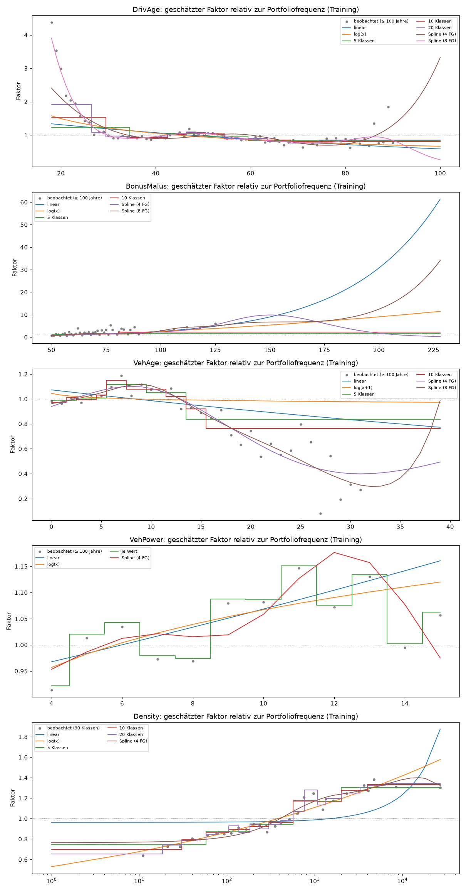

# Teil 3 – Kodierung der Merkmale im GLM (automatisch erzeugt)

Erzeugt von `src/teil3_merkmale.py`. Nur Trainingsdaten, 5-fache Kreuzvalidierung mit Folds nach Merkmalsprofil. Metrik: mittlere Poisson-Deviance pro Police auf dem jeweils ausgelassenen Fold (kleiner ist besser). „± SE Abstand“ = Standardfehler des Abstands zur besten Kodierung, gepaart über dieselben Folds; ein Abstand von weniger als etwa 2 SE ist nicht klar von der besten unterscheidbar. Negativ-Binomial-GLM mit Log-Link und Offset log(Exposure); α für alle Vergleiche fest = 1.1169 (geschätzt im Modell mit allen Merkmalen in 10 Klassen). Klassen = ungefähr gleiche Exposure je Klasse, Grenzen aus den Trainingsdaten. Spline = natürlicher kubischer Regressionsspline mit FG Freiheitsgraden.

Achtung: Jedes Merkmal wird einzeln betrachtet. Teile der Effekte können von anderen Merkmalen stammen.

## M3.1 DrivAge

CV-Deviance ohne dieses Merkmal: 0.255027

| Kodierung | Parameter | CV-Deviance | Verbesserung ggü. ohne | Abstand zur besten | ± SE Abstand |
|---|---|---|---|---|---|
| linear | 1 | 0.254254 | 0.000773 | 0.001354 | 0.000123 |
| log(x) | 1 | 0.254031 | 0.000996 | 0.001132 | 0.000102 |
| 5 Klassen | 4 | 0.254325 | 0.000702 | 0.001426 | 0.000083 |
| 10 Klassen | 9 | 0.253723 | 0.001304 | 0.000823 | 0.000055 |
| 20 Klassen | 19 | 0.253326 | 0.001701 | 0.000427 | 0.000065 |
| Spline (4 FG) | 4 | 0.253401 | 0.001626 | 0.000502 | 0.000063 |
| Spline (8 FG) | 8 | 0.252899 | 0.002128 | 0.000000 | 0.000000 |

## M3.2 BonusMalus

CV-Deviance ohne dieses Merkmal: 0.255027

| Kodierung | Parameter | CV-Deviance | Verbesserung ggü. ohne | Abstand zur besten | ± SE Abstand |
|---|---|---|---|---|---|
| linear | 1 | 0.247084 | 0.007943 | 0.001071 | 0.000091 |
| log(x) | 1 | 0.246981 | 0.008046 | 0.000968 | 0.000057 |
| 5 Klassen | 2 | 0.248454 | 0.006573 | 0.002441 | 0.000069 |
| 10 Klassen | 4 | 0.247482 | 0.007545 | 0.001469 | 0.000058 |
| Spline (4 FG) | 4 | 0.246864 | 0.008163 | 0.000851 | 0.000078 |
| Spline (8 FG) | 8 | 0.246013 | 0.009014 | 0.000000 | 0.000000 |

## M3.3 VehAge

CV-Deviance ohne dieses Merkmal: 0.255027

| Kodierung | Parameter | CV-Deviance | Verbesserung ggü. ohne | Abstand zur besten | ± SE Abstand |
|---|---|---|---|---|---|
| linear | 1 | 0.254953 | 0.000074 | 0.000308 | 0.000068 |
| log(x+1) | 1 | 0.255031 | -0.000004 | 0.000386 | 0.000078 |
| 5 Klassen | 4 | 0.254758 | 0.000269 | 0.000113 | 0.000044 |
| 10 Klassen | 9 | 0.254728 | 0.000299 | 0.000083 | 0.000027 |
| Spline (4 FG) | 4 | 0.254645 | 0.000382 | 0.000000 | 0.000000 |
| Spline (8 FG) | 8 | 0.254653 | 0.000374 | 0.000008 | 0.000010 |

## M3.4 VehPower

CV-Deviance ohne dieses Merkmal: 0.255027

| Kodierung | Parameter | CV-Deviance | Verbesserung ggü. ohne | Abstand zur besten | ± SE Abstand |
|---|---|---|---|---|---|
| linear | 1 | 0.254988 | 0.000039 | 0.000026 | 0.000044 |
| log(x) | 1 | 0.254984 | 0.000043 | 0.000022 | 0.000044 |
| je Wert | 11 | 0.254962 | 0.000065 | 0.000000 | 0.000000 |
| Spline (4 FG) | 4 | 0.254991 | 0.000036 | 0.000029 | 0.000031 |

## M3.5 Density

CV-Deviance ohne dieses Merkmal: 0.255027

| Kodierung | Parameter | CV-Deviance | Verbesserung ggü. ohne | Abstand zur besten | ± SE Abstand |
|---|---|---|---|---|---|
| linear | 1 | 0.254588 | 0.000439 | 0.001147 | 0.000111 |
| log(x) | 1 | 0.253480 | 0.001547 | 0.000039 | 0.000052 |
| 5 Klassen | 4 | 0.253476 | 0.001551 | 0.000035 | 0.000044 |
| 10 Klassen | 9 | 0.253458 | 0.001569 | 0.000018 | 0.000038 |
| 20 Klassen | 19 | 0.253441 | 0.001587 | 0.000000 | 0.000000 |
| Spline (4 FG) | 4 | 0.253502 | 0.001525 | 0.000061 | 0.000040 |

## M3.6 Region allein

CV-Deviance ohne dieses Merkmal: 0.255027

| Kodierung | Parameter | CV-Deviance | Verbesserung ggü. ohne | Abstand zur besten | ± SE Abstand |
|---|---|---|---|---|---|
| 22 einzeln | 21 | 0.254139 | 0.000888 | 0.000005 | 0.000008 |
| Regionen < 1 % Exposure zusammen | 14 | 0.254156 | 0.000871 | 0.000022 | 0.000013 |
| Regionen < 2 % Exposure zusammen | 11 | 0.254221 | 0.000807 | 0.000087 | 0.000013 |
| 3 Gruppen nach Frequenz | 2 | 0.254184 | 0.000843 | 0.000050 | 0.000012 |
| 5 Gruppen nach Frequenz | 4 | 0.254210 | 0.000817 | 0.000076 | 0.000018 |
| 8 Gruppen nach Frequenz | 7 | 0.254134 | 0.000893 | 0.000000 | 0.000000 |

## M3.7 Region zusätzlich zu Density

Density hier nur als Kontrolle mit log(x) im Modell, damit sichtbar wird, was Region über Density hinaus erklärt.

CV-Deviance ohne dieses Merkmal: 0.253480

| Kodierung | Parameter | CV-Deviance | Verbesserung ggü. ohne | Abstand zur besten | ± SE Abstand |
|---|---|---|---|---|---|
| 22 einzeln | 21 | 0.253112 | 0.000368 | 0.000000 | 0.000000 |
| Regionen < 1 % Exposure zusammen | 14 | 0.253143 | 0.000337 | 0.000031 | 0.000007 |
| Regionen < 2 % Exposure zusammen | 11 | 0.253218 | 0.000262 | 0.000106 | 0.000021 |
| 3 Gruppen nach Frequenz | 2 | 0.253327 | 0.000153 | 0.000215 | 0.000052 |
| 5 Gruppen nach Frequenz | 4 | 0.253272 | 0.000208 | 0.000160 | 0.000063 |
| 8 Gruppen nach Frequenz | 7 | 0.253183 | 0.000297 | 0.000071 | 0.000037 |

## M3.8 Zuordnung der Regionen (Training)

| Region | Anteil Exposure | Frequenz | Regionen < 1 % Exposure zusammen | Regionen < 2 % Exposure zusammen | 3 Gruppen nach Frequenz | 5 Gruppen nach Frequenz | 8 Gruppen nach Frequenz |
|---|---|---|---|---|---|---|---|
| Midi-Pyrenees | 1.95% | 0.052 | Midi-Pyrenees | kleine Regionen | Gruppe 1 | Gruppe 1 | Gruppe 1 |
| Lorraine | 2.26% | 0.058 | Lorraine | Lorraine | Gruppe 1 | Gruppe 1 | Gruppe 1 |
| Auvergne | 0.65% | 0.0591 | kleine Regionen | kleine Regionen | Gruppe 1 | Gruppe 1 | Gruppe 1 |
| Basse-Normandie | 1.85% | 0.0623 | Basse-Normandie | kleine Regionen | Gruppe 1 | Gruppe 1 | Gruppe 1 |
| Centre | 28.77% | 0.0636 | Centre | Centre | Gruppe 1 | Gruppe 2 | Gruppe 2 |
| Champagne-Ardenne | 0.33% | 0.0638 | kleine Regionen | kleine Regionen | Gruppe 2 | Gruppe 2 | Gruppe 3 |
| Haute-Normandie | 0.88% | 0.0658 | kleine Regionen | kleine Regionen | Gruppe 2 | Gruppe 2 | Gruppe 3 |
| Bretagne | 7.79% | 0.0678 | Bretagne | Bretagne | Gruppe 2 | Gruppe 3 | Gruppe 4 |
| Bourgogne | 1.41% | 0.0687 | Bourgogne | kleine Regionen | Gruppe 2 | Gruppe 3 | Gruppe 4 |
| Pays-de-la-Loire | 6.12% | 0.0701 | Pays-de-la-Loire | Pays-de-la-Loire | Gruppe 2 | Gruppe 3 | Gruppe 4 |
| Poitou-Charentes | 3.14% | 0.0719 | Poitou-Charentes | Poitou-Charentes | Gruppe 2 | Gruppe 3 | Gruppe 5 |
| Aquitaine | 3.99% | 0.0743 | Aquitaine | Aquitaine | Gruppe 2 | Gruppe 3 | Gruppe 5 |
| Languedoc-Roussillon | 4.06% | 0.0748 | Languedoc-Roussillon | Languedoc-Roussillon | Gruppe 2 | Gruppe 4 | Gruppe 5 |
| Franche-Comte | 0.15% | 0.0771 | kleine Regionen | kleine Regionen | Gruppe 2 | Gruppe 4 | Gruppe 6 |
| Alsace | 0.33% | 0.0791 | kleine Regionen | kleine Regionen | Gruppe 2 | Gruppe 4 | Gruppe 6 |
| Corse | 0.49% | 0.0806 | kleine Regionen | kleine Regionen | Gruppe 2 | Gruppe 4 | Gruppe 6 |
| Provence-Alpes-Cotes-D'Azur | 9.95% | 0.0837 | Provence-Alpes-Cotes-D'Azur | Provence-Alpes-Cotes-D'Azur | Gruppe 3 | Gruppe 4 | Gruppe 6 |
| Nord-Pas-de-Calais | 3.19% | 0.0851 | Nord-Pas-de-Calais | Nord-Pas-de-Calais | Gruppe 3 | Gruppe 4 | Gruppe 7 |
| Ile-de-France | 8.41% | 0.0858 | Ile-de-France | Ile-de-France | Gruppe 3 | Gruppe 5 | Gruppe 7 |
| Limousin | 0.67% | 0.0886 | kleine Regionen | kleine Regionen | Gruppe 3 | Gruppe 5 | Gruppe 7 |
| Picardie | 1.00% | 0.0903 | kleine Regionen | kleine Regionen | Gruppe 3 | Gruppe 5 | Gruppe 7 |
| Rhone-Alpes | 12.62% | 0.0948 | Rhone-Alpes | Rhone-Alpes | Gruppe 3 | Gruppe 5 | Gruppe 8 |

## P3.1 Geschätzte Verläufe je Kodierung

